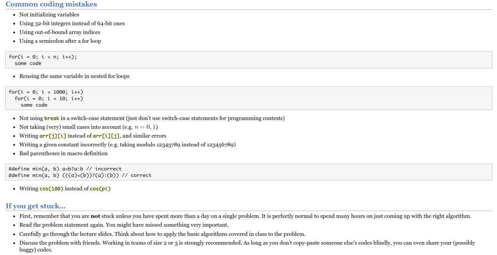

# Job Preparation

My Leetcode Account - [Md. Nahid Hassan](https://leetcode.com/nahidmdh18/)

- Samsung
- **Enosis**
- **Therap**

## Languages

- **C++**
- C#
- Python
- Java

## Study Plan

- **Data Structures**
  - Array Processing 
    - Sorting, Searching, Two Pointers, Sliding Window
  - Linked List
  - Stack and Queue
  - Tree
  - Priority Queue
  - Hash Map
  - Set
- **Algorithms**
  - General
  - Backtracking & Greedy
  - Graph
- **Number Theory**
  - Prime Number Generation (Sieve, Segmented Sieve)
  - Euler Totient Theorem
  - Fermat’s Theorem
  - HCF & LCM (Euclid)
  - Linear Diophantine Equations (Extended Euclid)
  - Modulus Arithmetic (addition,multiplication,subtraction,modular Inverse)
  - Cycle Finding (Floyd Algo and Brent Algo)
  - Integer Factorization (Trial Division , Pollard Rho method)
  - Lucas Theorem (Simple & Advance)
  - Chinese Remainder Theorem
  - Wilson Theorem
  - Miller - Rabin Primality Testing
  - Perfect Numbers
  - Goldbach Conjecture

## Books

- Competitive Programming Handbook - Generalize
- Competitive Programming 3 - Uva 

## Other Resources

- CP Algorithms
- Tamim
- Tusar Roy

- [Stanford Algorithms](https://web.stanford.edu/class/cs97si/)
- [Awesome Courses](https://github.com/prakhar1989/awesome-courses#algorithms)
- [Number Theory](https://artofproblemsolving.com/community/c90633h1291397)

## Github Repository

- [Hasan Abdullah](https://github.com/hasancse91)

## Common Mistakes

