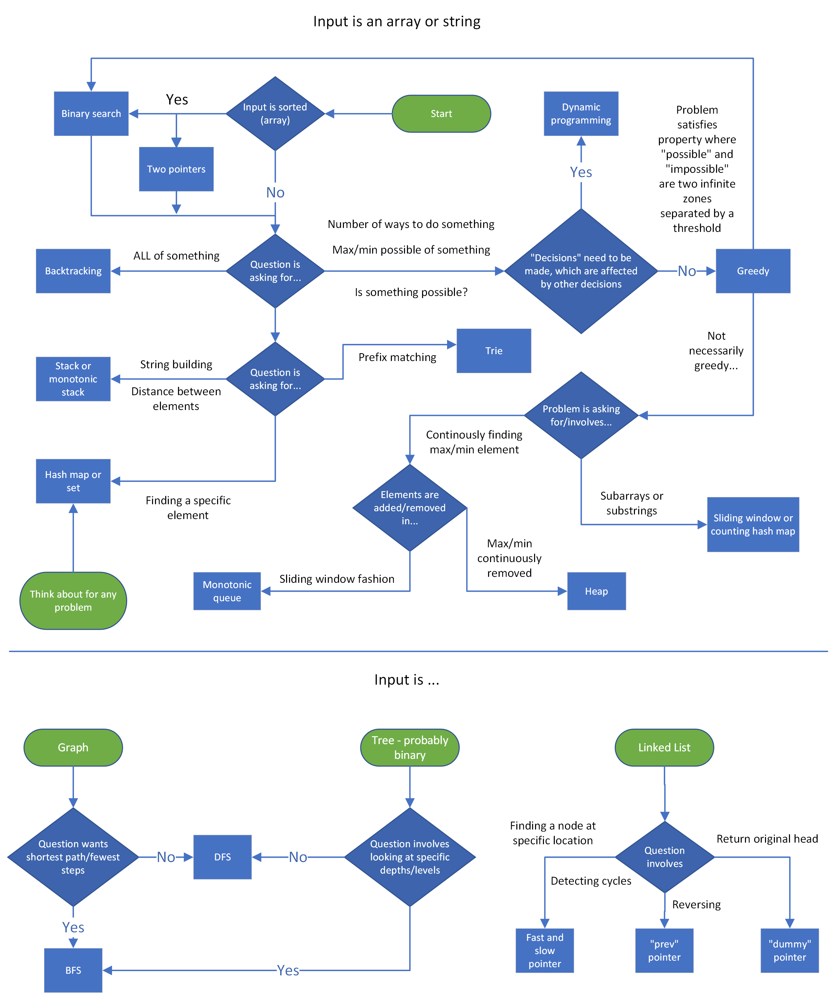
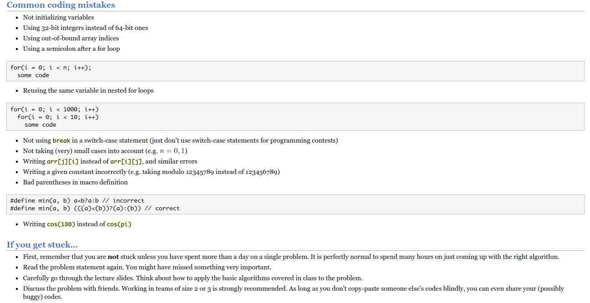

# SE Job Preparation

> My Leetcode Account - [Md. Nahid Hassan](https://leetcode.com/nahidmdh18/) - Solving Idea: [Leetcode Problem Solving Ideas - README](https://github.com/Nahid-Hassan/job-prep/blob/main/LEETCODE_SOL_IDEA.md)

- Samsung
- **Enosis** - `C#`
- **Therap** - `C++/Java`
- **Reve Systems** `Java Sprint Boot/C++`

## Languages

- [C Programming](https://youtu.be/j-_s8f5K30I)
- **C++**
- C#
- Python
- Java

## Study Plan

- **Data Structures**
  - Array Processing 
    - Sorting, Searching, Two Pointers, Sliding Window
  - Linked List
  - Stack and Queue
  - Tree
  - Priority Queue
  - Hash Map
  - Set
- **Algorithms**
  - General
  - Backtracking & Greedy
  - Graph
- **Number Theory**
  - Prime Number Generation (Sieve, Segmented Sieve)
  - Euler Totient Theorem
  - Fermat’s Theorem
  - HCF & LCM (Euclid)
  - Linear Diophantine Equations (Extended Euclid)
  - Modulus Arithmetic (addition,multiplication,subtraction,modular Inverse)
  - Cycle Finding (Floyd Algo and Brent Algo)
  - Integer Factorization (Trial Division , Pollard Rho method)
  - Lucas Theorem (Simple & Advance)
  - Chinese Remainder Theorem
  - Wilson Theorem
  - Miller - Rabin Primality Testing
  - Perfect Numbers
  - Goldbach Conjecture

## Books

- Competitive Programming Handbook - Generalize
- Competitive Programming 3 - Uva 

### Interview Preparation Book

- [Cracking the Coding Interview](https://github.com/Nahid-Hassan/job-prep/blob/main/interview-books/Cracking%20the%20Coding%20Interview%20189%20Programming%20Questions%20and%20Solutions%20Gayle%20Laakmann%20McDowell.pdf)

## Solving Idea

## Other Resources

- CP Algorithms
- Tamim
- Tusar Roy

- [Stanford Algorithms](https://web.stanford.edu/class/cs97si/)
- [Awesome Courses](https://github.com/prakhar1989/awesome-courses#algorithms)
- [Number Theory](https://artofproblemsolving.com/community/c90633h1291397)
- [Catalan Number](https://youtu.be/0pTN0qzpt-Y)
- [Graph Algorithms](https://www.youtube.com/watch?v=s7zE4Nmc2Fg&list=PL5DyztRVgtRVLwNWS7Rpp4qzVVHJalt22)

## Github Repository

- [Hasan Abdullah](https://github.com/hasancse91)
- [CTCI C++ Edition](https://github.com/careercup/CtCI-6th-Edition-cpp)
- [Algorithms - William Fiset](https://github.com/williamfiset/algorithms)

## Common Mistakes

