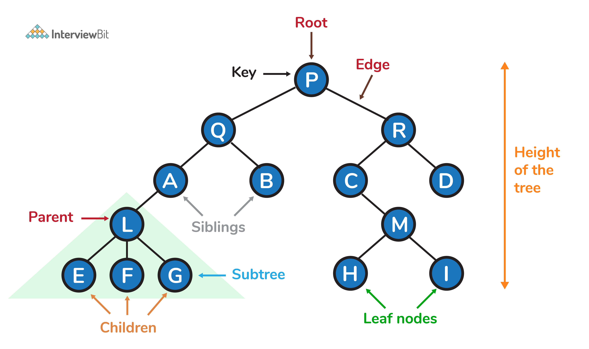

# Tree Data Structures



- [Tree Data Structures](#tree-data-structures)
  - [Create your first **Binary Tree**:](#create-your-first-binary-tree)
  - [Depth First Traverse - Using Stack (Iterative)](#depth-first-traverse---using-stack-iterative)
  - [Breadth First Search - Queue](#breadth-first-search---queue)

Being a **Binary Tree**:

- Have at most two nodes.
- Exactly one root.
- Exactly one path between root to any node. (Unique Path)

## Create your first **Binary Tree**:

- Create **TreeNode**:

```c++
#include <bits/stdc++.h>
using namespace std;

struct TreeNode {
    int val;
    TreeNode* left;
    TreeNode* right;

    TreeNode(): val(0), left(nullptr), right(nullptr) {}
    TreeNode(int d): val(d), left(nullptr), right(nullptr) {}
};

```

**Traverse Tree**:

```c++
/*
TC: O(n)
OC: O(n)
*/

void preorder(TreeNode* root) {
    if (!root) return;
    cout << root->val << "->";
    preorder(root->left);
    preorder(root->right);
}
```

**We are trying to create a tree look like this**:

```plaintext
/*
                1
               / \
              2   3
             / \   \
            4   5   6
*/
```

**Driver Program**:

```c++
int main() {
    TreeNode* root = new TreeNode(1);
    root->left = new TreeNode(2);
    root->right = new TreeNode(3);
    root->left->left = new TreeNode(4);
    root->left->right = new TreeNode(5);
    root->right->right = new TreeNode(6);

    preorder(root);
}
```

## Depth First Traverse - Using Stack (Iterative)

```plaintext
Output: 1 2 4 5 3 6
```

```c++
/*
TC: O(n)
OC: O(n)
*/

// iterative traverse - preorder
void dft(TreeNode* root) {
    stack<TreeNode*> st;

    if(!root) return;
    st.push(root);

    while (!st.empty()) {
        TreeNode* node = st.top();
        cout << node->val << "->";
        st.pop();

        if (node->right) st.push(node->right);
        if (node->left) st.push(node->left);
    }
}
```

## Breadth First Search - Queue

```plaintext
Output: 1 2 3 4 5 6
```

```c++
/*
TC: O(n)
OC: O(n)
*/
void bft(TreeNode* root) {
    if (!root) return;
    queue <TreeNode*> q;
    q.push(root);

    while (!q.empty()) {
        TreeNode* node = q.front();
        cout << node->val << " ";
        q.pop();

        if (node->left) q.push(node->left);
        if (node->right) q.push(node->right);
    }
}
```
