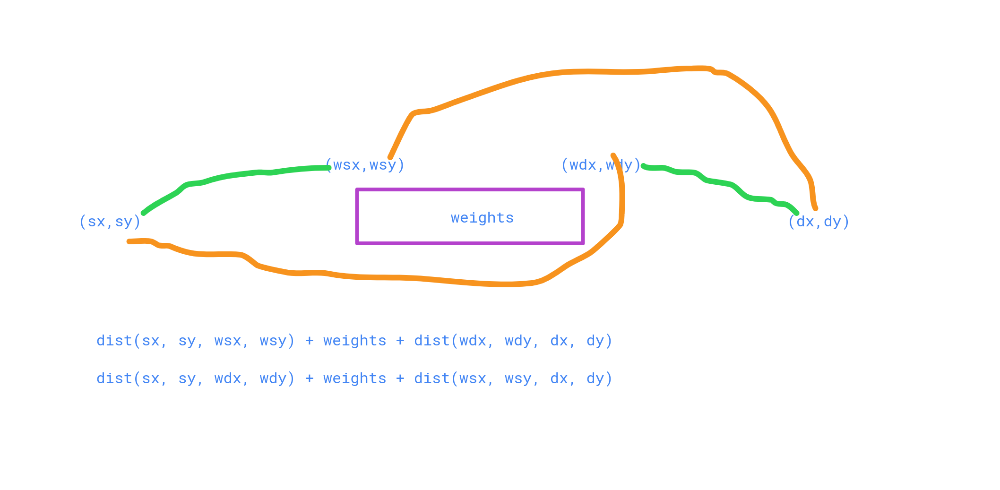

1. Heading

# H1

lorem19 a
f
f
asd
fsa
f
sdf


## h2
### h3 
#### h4

2. Image




3. Link

[Happy Github](https://www.github.com/TasrinSultana)
[ll](#h1)

1. Table
2. Code Block
3. Bold, italic, bold italic, mark


## Problem Description:

```text
Men's restroom problem: It is a well-researched fact that men in a restroom generally prefer to maximize their distance from already occupied stalls, by occupying the middle of the longest sequence of unoccupied places. For a detailed version, check the following link.
```

## Simulation:

```text

```

## Code

```c++
int main(){
    int t,n,k;
    scanf("%d",&t);
    while(t--){
        scanf("%d %d",&n,&k);
        solve(n,k);
        printAns(n);
    }
    return 0;
}
```