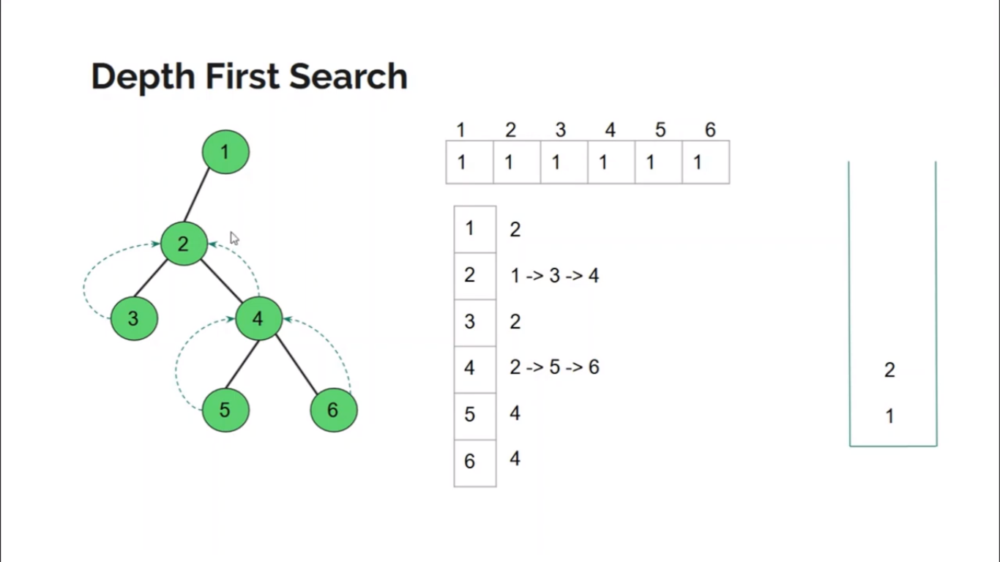

## Depth First Search

- [Depth First Search](#depth-first-search)
  - [Algorithms](#algorithms)
  - [Implementation using C++](#implementation-using-c)


### Algorithms



### Implementation using C++

```c++
void dfs(int v) {
    vis[v] = 1;
    cout << v << "->";

    for (auto u : adj[v]) {
        if (vis[u] == 0) {
            dfs(u);
        }
    }
}
```