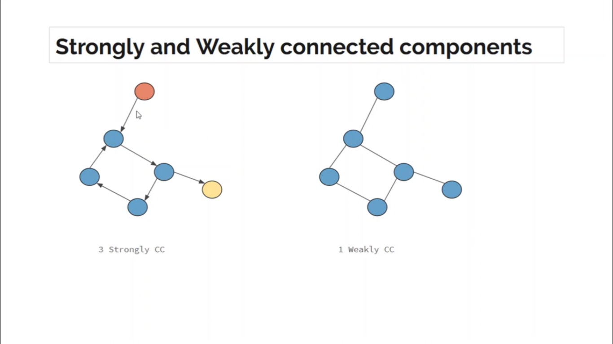

## Number of Connected Components or nCC

- [Number of Connected Components or nCC](#number-of-connected-components-or-ncc)
  - [Concept of CC](#concept-of-cc)
  - [Implementation using C++](#implementation-using-c)

### Concept of CC



### Implementation using C++

```c++
// This code is just a template not real code .......

#include<bits/stdc++.h>
using namespace std;

int n, m;

vector<int> adj[n+1];
bool vis[n] = {0};

void dfs(int v) {
    vis[v] = true;
    for (int u : adj[v]) {
        if (vis[u] == 0) {
            dfs(u);
        }
    }
}

int main() {
    // ....
    // ....

    cin >> n >> m;

    // create adjacency list

    int cc_count = 0;
    for (int i = 1; i <= n; i++) {
        if (vis[i] == 0) {
            dfs(i);
            cc_count++;
        }
    }

    cout << "#CC_Count = " << cc_count << endl;
}
```