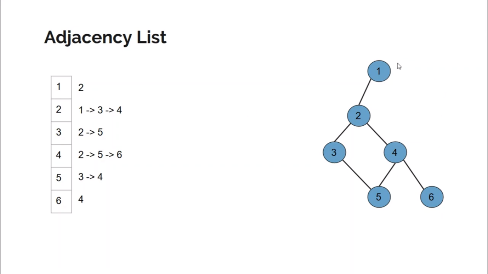

## Graph Representation

- [Graph Representation](#graph-representation)
  - [Adjacency List](#adjacency-list)


### Adjacency List Representation



### Implementation using C++

```c++
int n; // no of nodes
int m; // no of edges

vector<int> adj[N+1];

while (m--) {
    cin >> a >> b;
    adj[a].push_back(b);
    adj[b].push_back(a);
}
```