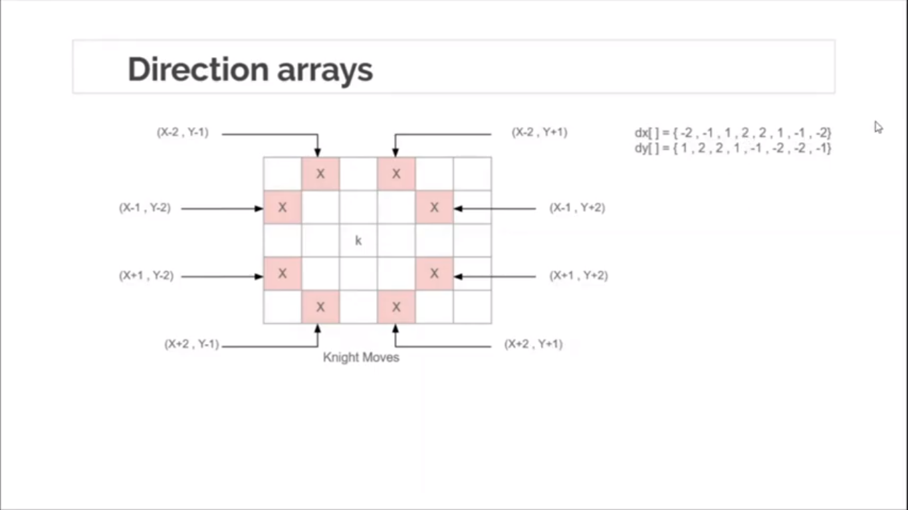
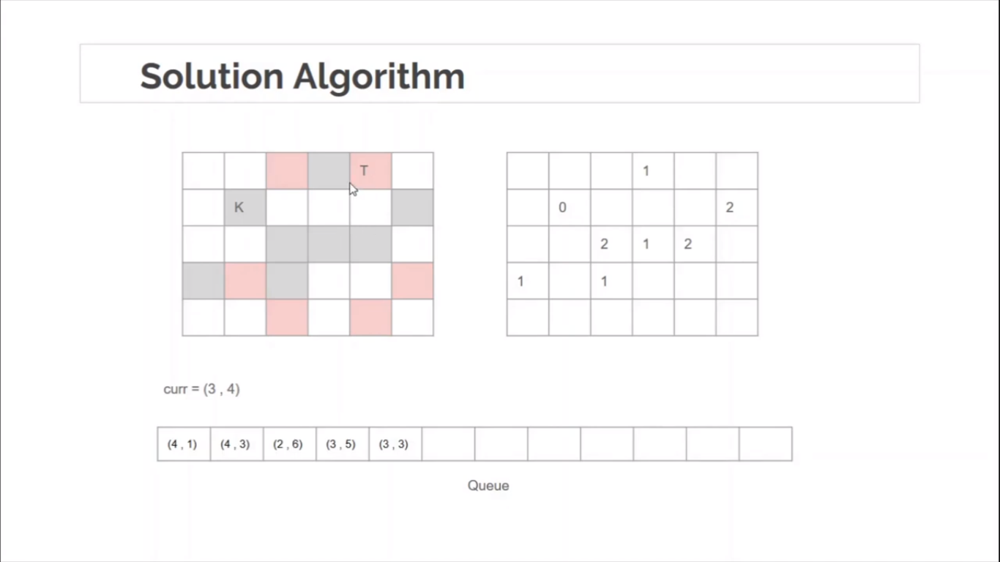

## Minimum moves to reach target by Knight 


> Leetcode Problem Link: [Minimum Knight Moves - 1197](https://leetcode.com/problems/minimum-knight-moves/)


- [Minimum moves to reach target by Knight](#minimum-moves-to-reach-target-by-knight)
  - [Calculate the Direction Array](#calculate-the-direction-array)
  - [Solution Algorithm](#solution-algorithm)
  - [Implementation using BFS on 2D-Grid](#implementation-using-bfs-on-2d-grid)
  - [Input-Output Experiments](#input-output-experiments)


### Calculate the Direction Array



### Solution Algorithm



### Implementation using BFS on 2D-Grid

```c++
#include<bits/stdc++.h>
using namespace std;

// maze size, & direction array
int N, M;
int dx[] = {-2, -1, +1, +2, +2, +1, -1, -2};
int dy[] = {+1, +2, +2, +1, -1, -2, -2, -1};

// queue, visited 2-d array, & 2-d distance array or matrix
queue<pair<int, int>> q;
bool vis[1001][1001] = {0};
int dist[1001][1001] = {0};


// boundary and already visited or not checking
bool isValid(int x, int y) {
    if (x < 1 or y < 1 or x > N or x > M) return false;
    if (vis[x][y] == 1) return false;
    return true;
}

// apply bfs method
void bfs_grid(int x, int y) {
    q.push({x, y});
    dist[x][y] = 0;
    vis[x][y] = 1;


    while(!q.empty()) {
        int curx = q.front().first;
        int cury = q.front().second;

        q.pop();
        for (int i = 0; i < 8; i++) {
            if (isValid(curx + dx[i], cury + dy[i])) {
                int newx = curx + dx[i];
                int newy = cury + dy[i];

                dist[newx][newy] = dist[curx][cury] + 1;
                vis[newx][newy] = 1;

                q.push({newx, newy});
            }
        }
    }

    for (int i = 1; i <= N; i++) {
        for (int j = 1; j <= M; j++) {
            cout << dist[i][j] << " ";
        } cout << endl;
    } cout << endl;
}

int main() {
    int x, y;

    cin >> N >> M;
    cin >> x >> y;

    bfs_grid(x, y);


    int tx, ty;
    cin >> tx >> ty;
    cout << dist[tx][ty] << endl;
}
```

### Input-Output Experiments


```txt
/*
8 8 # maze size
2 2 # start position or src index


// distance matrix
4 3 2 1 2 3 4 3 
3 0 3 2 3 2 3 4 
2 3 2 1 2 3 4 3 
1 2 1 4 3 2 3 4 
2 3 2 3 2 3 4 3 
3 2 3 2 3 4 3 4 
4 3 4 3 4 3 4 5 
3 4 3 4 3 4 5 4 

// minimum moves needed for 1, 5 position
1 5
2
*/
```