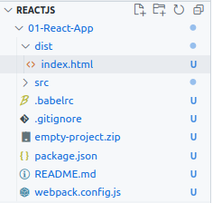

# React JS Introduction

**Table of Contents**:

- [React JS Introduction](#react-js-introduction)
  - [01 - Introduction](#01---introduction)
    - [1.1 Components](#11-components)
    - [1.2 Which Type of Problems React is Solving??](#12-which-type-of-problems-react-is-solving)
    - [1.4 ReactJS Core Features](#14-reactjs-core-features)
  - [02 - React Custom Environment](#02---react-custom-environment)
    - [2.1 Environment Setup](#21-environment-setup)
    - [2.2 Tools we needed?:](#22-tools-we-needed)
    - [2.4 File Structure of a React App - Custom React Working Environment](#24-file-structure-of-a-react-app---custom-react-working-environment)
  - [03 - Create-React-App Package](#03---create-react-app-package)
    - [3.1 `create-react-app` usages](#31-create-react-app-usages)
    - [3.6 Our First React Component](#36-our-first-react-component)
  - [04 - React Components and Props - More Depth](#04---react-components-and-props---more-depth)
    - [4.2 React Components and Props](#42-react-components-and-props)
    - [4.3 Types of Components](#43-types-of-components)
    - [4.4 Functional Components](#44-functional-components)
    - [4.5 Try to Learn JSX - More...](#45-try-to-learn-jsx---more)
    - [How to use JSX in React](#how-to-use-jsx-in-react)


## 01 - Introduction

### 1.1 Components

A **component** has two main layers.

- **Data layer** (Dynamic - based on data layer we render lots of things on the browser).
- **Representation Layer**(Static - HTML, CSS)

In React, our responsibility is to create a static view from small piece of UI & change the data anyhow. Rest of the thing react will do for us.

> It's easy, representation layer of a component can render other components.

```
Main component
    child component ... 1
    child component ... 2
    child component ... 3
            :
         ren:der
            :
    child component ... n

```


### 1.2 Which Type of Problems React is Solving??

- Mainly single page application.

> https://reactjs.org/community/examples.html

### 1.4 ReactJS Core Features

- Components
- Props & **State**
- **Event**
- Conditional Rendering
- List and Tables
- Forms and Input Elements
- Lifting State Up
- Composition and Component Tree

## 02 - React Custom Environment

### 2.1 Environment Setup

- Tools we need to up & running react.
- BabelJS & Webpack Setup
- Create custom environment
- Create our first React App

### 2.2 Tools we needed?:

- **Babel** - React to JavaScript 
- **Webpack** - File & Image

```bash
$ sudo apt install npm    # node package manager
$ sudo npm -g install create-react-app  # helps to create react app
```

### 2.4 File Structure of a React App - Custom React Working Environment

[Create Minimal React App - with Custom Environment](https://createapp.dev/webpack/react--babel--code-split-vendors--css--css-modules--png--react-hot-loader)

 


`/01-React-App/dist/index.html` - A output file. 

`/01-React-App/src/App.js` - First React Application.
`/01-React-App/src/index.js` - Root file. App loaded from here. Connection with React.
`/01-React-App/src/styles.css` - We can work with `css`.

`/01-React-App/.babelrc` - Convert modern React - JavaScript to old JS. Contain **Plugin Section**.

`/01-React-App/package.json` - Contains dependencies and scripts.

`/01-React-App/webpack.config.js` - Our main configuration file. 

- Then finally install node modules and run project.

```bash
$ npm install
$ npm start
```

## 03 - Create-React-App Package

### 3.1 `create-react-app` usages

```bash
$ npx create-react-app app-name    # create react app
$ npm start                        # to start react app
$ npm run eject                    # eject react app - Learn something extra for this command
```

### 3.6 Our First React Component

```bash
$ cd src/
$ rm react.*
$ mkdir components
$ touch components/app.jsx
$ vim components/app.jsx

...
import React, {Component} from 'react';

class App extends Component {
    // presentation layer
    render() {
        // must contain a return method
        return <h1>Hello Nahid</h1>;
    }
}

// must export every components
// default export
export default App;

$ npm start             #! show some errors

# to fix that we need some changes in src/index.js

$ vim index.js

... 

# import App from 'app'; 
import App from './components/app';      # change to that

$ npm start            # Congratulations 
```

## 04 - React Components and Props - More Depth

### 4.2 React Components and Props

```text
Components {
  // Data 
  1. State - Any changes in state recall render().
  2. Variables or Properties - Changes in variable don't call render()
  3. Function or methods
  4. Life Cycle Function - (Advanced Concept)

  // Representation
  render () {
      // return jsx
  }
}

```

### 4.3 Types of Components

1. Class Component - React Components 
2. Functional Component - JavaScript Function as a Component

> We already seen Class based Components.

### 4.4 Functional Components

!Warning - Not Tested this block of code.

```js
// functional components
function myFunctionalComponent() {
    const name = "Md. Nahid Hassan";
    
    // any function that return jsx is functional components
    return <h1>H1 Tag - Try to understand functional Components</h1>;
}

// arrow function

// explicit return
const anotherFunctionalComponent  = () => {
    return <p>I am another functional component - using arrow function to create component</p>;
}

// implicit return
const anotherFunctionalComponent1 = () => (
    <h1>Functional Components by arrow function - implicit return</h1>
);
```

### 4.5 Try to Learn JSX - More...

### How to use JSX in React